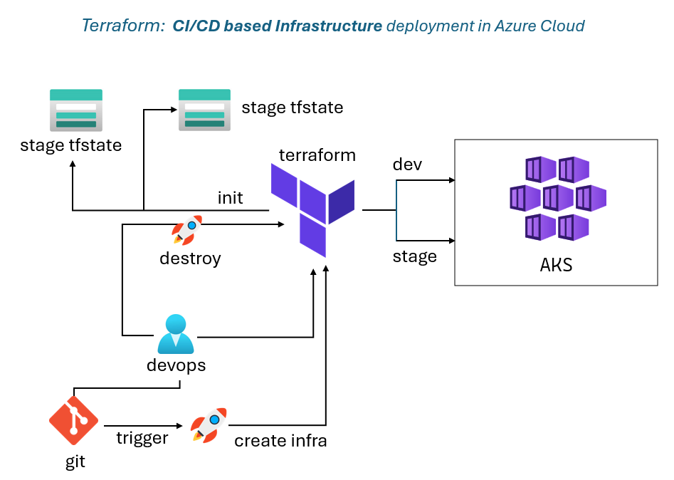
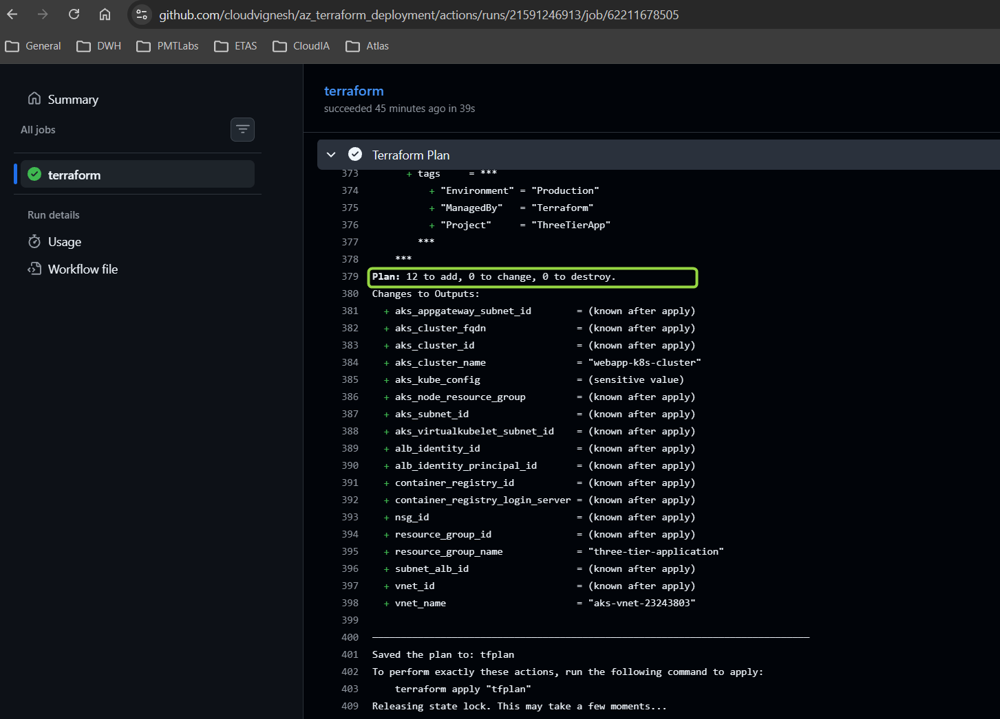

# Azure Kubernetes Service (AKS) Infrastructure with Terraform
A production-ready Infrastructure as Code (IaC) solution for deploying a complete Azure Kubernetes Service (AKS) environment with supporting resources using Terraform. This project demonstrates best practices in cloud infrastructure automation, modular design, and enterprise-grade Kubernetes deployments.

## Table of Contents

- [Overview](#overview)
- [Architecture](#architecture)
- [Features](#features)
- [Technologies Used](#technologies-used)
- [Project Structure](#project-structure)
- [Prerequisites](#prerequisites)
- [Getting Started](#getting-started)
- [Configuration](#configuration)
- [Deployment](#deployment)
- [Modules](#modules)
- [Best Practices](#best-practices)
- [Troubleshooting](#troubleshooting)

## Overview

This project provides a fully automated infrastructure deployment for Azure Kubernetes Service using Terraform. It creates a complete, production-ready environment including networking, container registry, managed identities, and AKS cluster with auto-scaling capabilities.

**Key Highlights:**
-  **Modular Architecture**: Reusable, maintainable Terraform modules
-  **Secure by Design**: Network isolation, managed identities, and security groups
-  **Auto-Scaling**: Configurable node pool auto-scaling (1-5 nodes)
-  **Enterprise Networking**: Multi-subnet VNet with proper CIDR allocation
-  **Container Registry**: Integrated Azure Container Registry (ACR)
-  **Remote State**: Azure Storage backend for state management
-  **Resource Tagging**: Consistent tagging strategy across all resources

## Architecture





### Components

1. **Network Layer**
   - VNet with /12 CIDR (10.224.0.0/12)
   - Multiple subnets for different workloads
   - Network Security Groups (NSGs)
   - Subnet-level isolation

2. **Compute Layer**
   - AKS cluster with Azure CNI networking
   - Auto-scaling node pool (1-5 nodes)
   - Standard_DS2_v2 VM size
   - System-assigned managed identity

3. **Registry Layer**
   - Azure Container Registry (ACR)
   - Private image storage
   - Integration with AKS

4. **Identity & Access**
   - User-assigned managed identities
   - Azure RBAC integration
   - Service principal authentication

## Features

### Infrastructure Features
- **Multi-Subnet VNet**: Isolated subnets for AKS, App Gateway, and Virtual Kubelet
- **AKS Cluster**: Production-ready Kubernetes cluster (v1.27)
- **Auto-Scaling**: Horizontal node pool auto-scaling (min: 1, max: 5)
- **Azure CNI**: Advanced networking with Azure Container Networking Interface
- **Container Registry**: Private ACR for container image storage
- **Managed Identities**: Secure authentication without credentials
- **Remote State**: Terraform state stored in Azure Storage
- **Network Security**: NSG rules and network policies

### DevOps Features
-  **Modular Design**: Reusable Terraform modules
-  **Environment Separation**: Dev/QA configurations via tfvars
-  **State Locking**: Prevents concurrent modifications
-  **Provider Pinning**: Consistent deployments with version constraints
-  **Resource Tagging**: Organized resource management

##  Technologies Used

| Technology | Version | Purpose |
|------------|---------|---------|
| **Terraform** | 1.13.2 | Infrastructure as Code |
| **AzureRM Provider** | 4.32.0 | Azure Resource Management |
| **Azure Kubernetes Service** | 1.27 | Container Orchestration |
| **Azure Container Registry** | - | Container Image Registry |
| **Azure Virtual Network** | - | Network Infrastructure |
| **Azure Storage** | - | Terraform State Backend |

##  Project Structure

```
az_terraform_deployment/
├── README.md                           # Project documentation
├── infra/                              # Main infrastructure configuration
│   ├── main.tf                         # Root module configuration
│   ├── variables.tf                    # Input variables
│   └── outputs.tf                      # Output values
├── dev/                                # Development environment
│   └── terraform.tfvars                # Dev-specific variables
├── qa/                                 # QA environment
│   └── terraform.tfvars                # QA-specific variables
└── modules/                            # Reusable Terraform modules
    ├── resource-group/                 # Resource group module
    │   ├── main.tf
    │   ├── variables.tf
    │   └── outputs.tf
    ├── network/                        # VNet and subnet module
    │   ├── main.tf
    │   ├── variables.tf
    │   └── outputs.tf
    ├── aks/                            # AKS cluster module
    │   ├── main.tf
    │   ├── variables.tf
    │   └── outputs.tf
    ├── container-registry/             # ACR module
    │   ├── main.tf
    │   ├── variables.tf
    │   └── outputs.tf
    ├── managed-identity/               # Managed identity module
    │   ├── main.tf
    │   ├── variables.tf
    │   └── outputs.tf
    └── application-gateway/            # App Gateway module
        ├── main.tf
        ├── variables.tf
        └── outputs.tf
```

## Prerequisites

Before deploying this infrastructure, ensure you have:

### Required Tools
- **Terraform** >= 1.13.2 ([Download](https://www.terraform.io/downloads))
- **Azure CLI** >= 2.0 ([Install Guide](https://docs.microsoft.com/en-us/cli/azure/install-azure-cli))
- **Git** (for version control)

### Azure Requirements
- Active Azure subscription
- Sufficient permissions to create resources
- Service Principal or Azure CLI authentication

### Required Azure Resources (Pre-deployment)
```bash
# Create resource group for Terraform state
az group create --name terraform-state-rg --location centralindia

# Create storage account for state
az storage account create \
  --name tfstoragethreetierapp \
  --resource-group terraform-state-rg \
  --location centralindia \
  --sku Standard_LRS

# Create container for state files
az storage container create \
  --name tfstate \
  --account-name tfstoragethreetierapp
```

## Getting Started

### 1. Clone the Repository
```bash
git clone https://github.com/yourusername/az_terraform_deployment.git
cd az_terraform_deployment
```

### 2. Authenticate with Azure
```bash
# Login to Azure
az login

# Set your subscription
az account set --subscription "your-subscription-id"

# Verify authentication
az account show
```

### 3. Configure Backend
Update the backend configuration in `infra/main.tf`:
```hcl
backend "azurerm" {
  resource_group_name  = "terraform-state-rg"
  storage_account_name = "tfstoragethreetierapp"
  container_name       = "tfstate"
  key                  = "three-tier-app.tfstate"
}
```

### 4. Initialize Terraform
```bash
cd infra
terraform init
```

## Configuration

### Environment Variables
Create a `dev/terraform.tfvars` or `qa/terraform.tfvars` file:

```hcl
# Basic Configuration
location         = "centralindia"
primary_rg_name  = "three-tier-application"

# Tags
tags = {
  Environment = "Development"
  ManagedBy   = "Terraform"
  Project     = "ThreeTierApp"
  Owner       = "DevOps Team"
}

# Network Configuration
vnet_name                = "aks-vnet-23243803"
vnet_address_space       = ["10.224.0.0/12"]
aks_subnet_address_prefix = "10.224.0.0/16"

# AKS Configuration
aks_cluster_name     = "webapp-k8s-cluster"
aks_node_count       = 3
aks_vm_size          = "Standard_DS2_v2"
kubernetes_version   = "1.27"

# Auto-scaling
aks_enable_auto_scaling = true
aks_min_count          = 1
aks_max_count          = 5

# Container Registry
acr_name         = "threetierapp"
acr_sku          = "Basic"
acr_admin_enabled = false
```

### Customization Options

| Variable | Default | Description |
|----------|---------|-------------|
| `location` | `centralindia` | Azure region for deployment |
| `aks_vm_size` | `Standard_DS2_v2` | VM size for AKS nodes |
| `aks_min_count` | `1` | Minimum nodes for auto-scaling |
| `aks_max_count` | `5` | Maximum nodes for auto-scaling |
| `kubernetes_version` | `1.27` | Kubernetes version |
| `acr_sku` | `Basic` | ACR tier (Basic/Standard/Premium) |

## Deployment

### Plan and Apply

```bash
# Navigate to infrastructure directory
cd infra

# Review the execution plan
terraform plan

# Apply the configuration
terraform apply

# Or use environment-specific variables
terraform apply -var-file="../dev/terraform.tfvars"
```

### Verify Deployment

```bash
# Get AKS credentials
az aks get-credentials \
  --resource-group three-tier-application \
  --name webapp-k8s-cluster

# Verify cluster access
kubectl get nodes
kubectl get pods --all-namespaces

# Check ACR
az acr list --resource-group three-tier-application
```

## Modules

### Resource Group Module
Creates and manages Azure resource groups.
```hcl
module "resource_group" {
  source   = "../modules/resource-group"
  name     = "my-resource-group"
  location = "centralindia"
  tags     = { Environment = "Dev" }
}
```

### Network Module
Deploys VNet, subnets, and NSGs.
```hcl
module "network" {
  source              = "../modules/network"
  vnet_name           = "my-vnet"
  resource_group_name = module.resource_group.name
  address_space       = ["10.0.0.0/16"]
  # ... additional configuration
}
```

### AKS Module
Provisions Azure Kubernetes Service cluster.
```hcl
module "aks_cluster" {
  source              = "../modules/aks"
  name                = "my-aks-cluster"
  kubernetes_version  = "1.27"
  default_node_pool   = {
    enable_auto_scaling = true
    min_count          = 1
    max_count          = 5
  }
}
```

### Container Registry Module
Creates Azure Container Registry.
```hcl
module "container_registry" {
  source              = "../modules/container-registry"
  name                = "myacr"
  sku                 = "Basic"
  admin_enabled       = false
}
```

## Best Practices

### Security
-  Use managed identities instead of service principals
-  Enable network policies on AKS
-  Implement NSG rules for subnet isolation
-  Use Azure Key Vault for secrets (recommended addition)
-  Enable Azure Policy for governance

### Cost Optimization
-  Use auto-scaling to optimize node count
-  Choose appropriate VM sizes for workloads
-  Implement pod autoscaling (HPA)
-  Use Azure Spot VMs for non-critical workloads
-  Set up budget alerts

### Operational Excellence
-  Use remote state with state locking
-  Implement CI/CD for infrastructure changes
-  Tag all resources consistently
-  Use workspace or separate state files for environments
-  Document infrastructure changes

## Troubleshooting

### Common Issues

**Issue: Terraform state lock**
```bash
# Solution: Force unlock (use with caution)
terraform force-unlock <LOCK_ID>
```

**Issue: AKS auto-scaling parameter error**
```bash
# Error: enable_auto_scaling not supported in provider v4.x
# Solution: Already fixed - node_count is set to null when auto-scaling is enabled
```

**Issue: Application Gateway resource not found**
```bash
# Error: azurerm_application_gateway_for_containers not supported
# Solution: Module uses placeholder - deploy manually or use AzAPI provider
```

**Issue: Insufficient quota**
```bash
# Request quota increase
az vm list-usage --location centralindia -o table
```

### Cleanup

```bash
# Destroy all resources
terraform destroy

# Or with variables file
terraform destroy -var-file="../dev/terraform.tfvars"

# Delete Terraform state (if needed)
az storage blob delete \
  --account-name tfstoragethreetierapp \
  --container-name tfstate \
  --name three-tier-app.tfstate
```

**Note**: This is a portfolio/learning project demonstrating Infrastructure as Code best practices. For production use, additional security hardening, monitoring, and backup strategies should be implemented.

---
**Built by [cloudvignesh](https://github.com/cloudvignesh)**